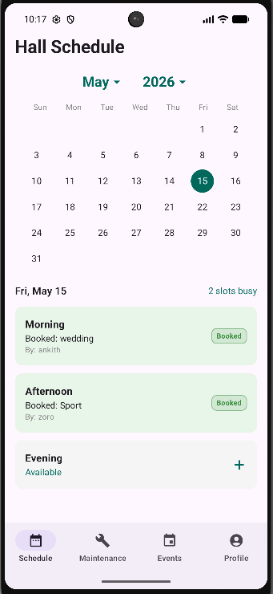
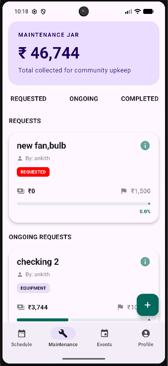
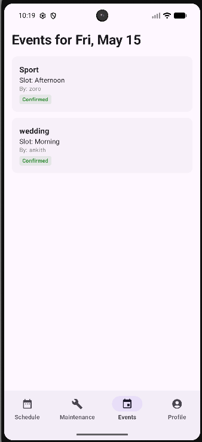
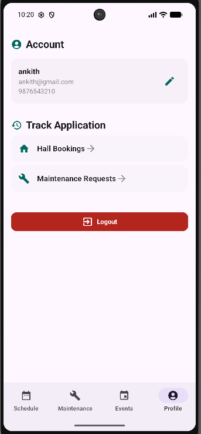
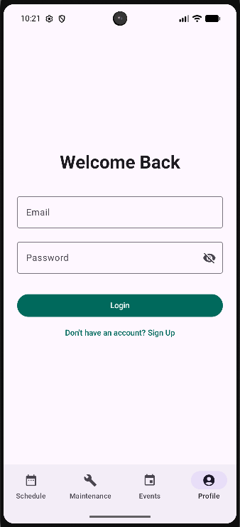

# Grama Angana

A modern Android app for managing hall schedules, maintenance requests, and daily events. The app provides:

- **Schedule**: View and book hall slots.
- **Maintenance**: Submit and track maintenance requests.
- **Events**: See today's events.
- **Profile**: Login and manage your account.

The app is built with **Jetpack Compose**, **Kotlin**, and uses **Firebase** for data storage and authentication.

## Screenshots

*Displays the hall booking interface with date selection and slot status*

*Shows the maintenance request submission form with item selection and priority options*

*Lists event details and booking availability for the current day*

*Shows user login status and profile management options*

*Displays authentication screen for email/password login*

## License
MIT License – see `LICENSE` for details.
